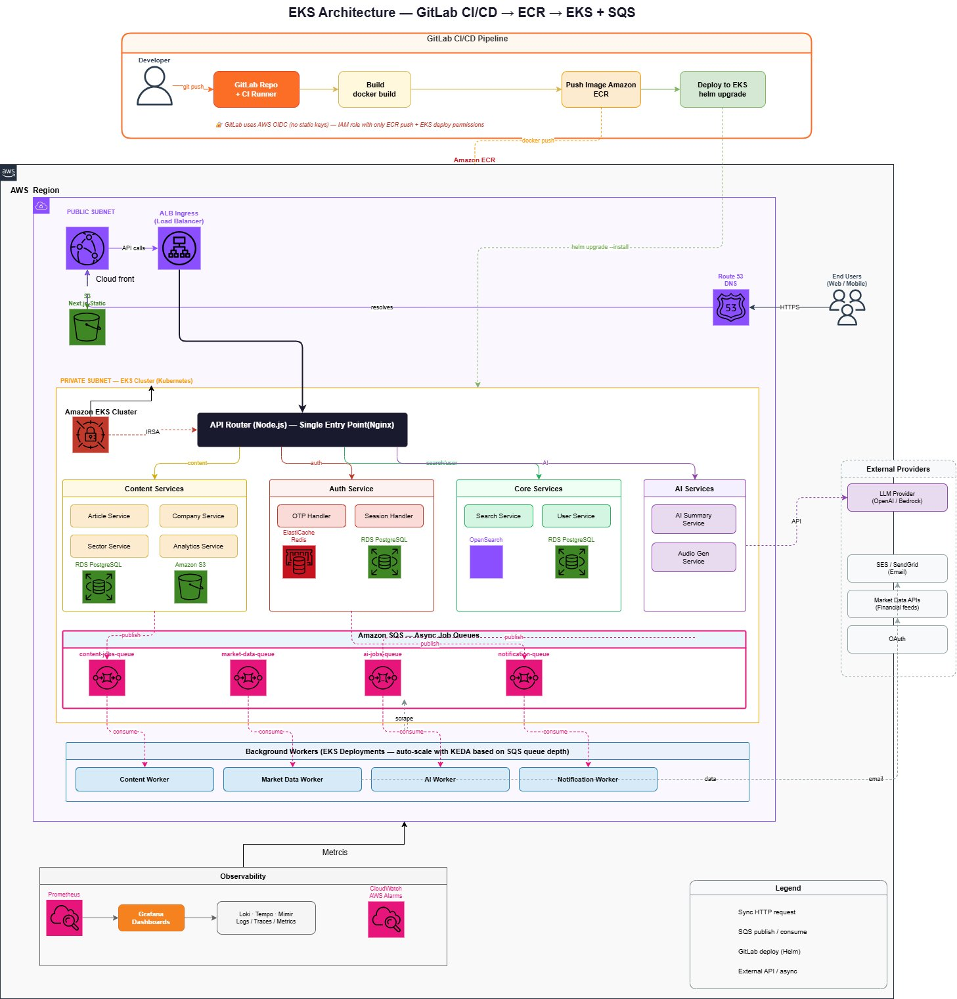

# 🚀 EKS Platform — Complete AWS Implementation Guide

> **GitLab CI/CD → ECR → EKS + SQS** — Full production-grade microservices platform on AWS  
> This guide takes you from zero to a fully running platform, step by step.

---

## 📐 Architecture Diagram



---

## 📋 Table of Contents

1. [Architecture Overview](#1-architecture-overview)
2. [Project Structure](#2-project-structure)
3. [Prerequisites](#3-prerequisites)
4. [Phase 1 — AWS Account Setup](#4-phase-1--aws-account-setup)
5. [Phase 2 — Terraform Infrastructure](#5-phase-2--terraform-infrastructure)
6. [Phase 3 — EKS Cluster Bootstrap](#6-phase-3--eks-cluster-bootstrap)
7. [Phase 4 — GitLab CI/CD Setup](#7-phase-4--gitlab-cicd-setup)
8. [Phase 5 — Deploy Microservices](#8-phase-5--deploy-microservices)
9. [Phase 6 — Observability Stack](#9-phase-6--observability-stack)
10. [Phase 7 — DNS & SSL](#10-phase-7--dns--ssl)
11. [Microservices Reference](#11-microservices-reference)
12. [SQS Queue Architecture](#12-sqs-queue-architecture)
13. [KEDA Autoscaling](#13-keda-autoscaling)
14. [Security Model](#14-security-model)
15. [Troubleshooting](#15-troubleshooting)
16. [Teardown](#16-teardown)

---

## 1. Architecture Overview

```
┌─────────────────────────────────────────────────────────────────────────────┐
│                         GitLab CI/CD Pipeline                               │
│                                                                             │
│  Developer ──git push──► GitLab Repo + CI Runner                           │
│                                   │                                         │
│                          Build Docker Image                                 │
│                                   │                                         │
│                    Push Image ──► Amazon ECR                               │
│                                   │                                         │
│                    Deploy ──────► EKS (helm upgrade --install)             │
│                                                                             │
│  ✅ GitLab uses AWS OIDC — NO static IAM keys anywhere                     │
└─────────────────────────────────────────────────────────────────────────────┘
                                    │ docker push / helm upgrade
                                    ▼
┌─────────────────────────────────────────────────────────────────────────────┐
│  AWS Region (e.g. us-east-1)                                               │
│                                                                             │
│  ┌─────────────────────────────────────────────────────────────────────┐   │
│  │  PUBLIC SUBNET                                                       │   │
│  │                                                                      │   │
│  │  End Users (Web/Mobile) ──HTTPS──► Route 53 DNS                    │   │
│  │                                          │ resolves                 │   │
│  │  CloudFront ◄──────────────────── ALB Ingress (Load Balancer)      │   │
│  │      │                                   │                          │   │
│  │  Next.js / Static ◄── S3 Bucket         │ API calls                │   │
│  └──────────────────────────────────────────┼───────────────────────── ┘   │
│                                             │                               │
│  ┌──────────────────────────────────────────▼───────────────────────────┐  │
│  │  PRIVATE SUBNET — EKS Cluster (Kubernetes)                           │  │
│  │                                                                      │  │
│  │  ┌────────────────────────────────────────────────────────────────┐  │  │
│  │  │  API Router (Node.js) — Single Entry Point (Nginx)             │  │  │
│  │  │  Port 3000 — Routes to all downstream services                 │  │  │
│  │  └──────────┬───────────────┬──────────────┬────────────────┬─────┘  │  │
│  │             │ /content      │ /auth        │ /search,/users │ /ai    │  │
│  │             ▼               ▼              ▼                ▼        │  │
│  │  ┌──────────────┐ ┌──────────────┐ ┌──────────────┐ ┌──────────────┐│  │
│  │  │Content Svc   │ │Auth Service  │ │Core Services │ │AI Services   ││  │
│  │  │:3001         │ │:3002         │ │:3003         │ │:3004         ││  │
│  │  │              │ │              │ │              │ │              ││  │
│  │  │Article Svc   │ │OTP Handler   │ │Search Svc    │ │AI Summary    ││  │
│  │  │Company Svc   │ │Session Handl │ │(OpenSearch)  │ │Audio Gen     ││  │
│  │  │Sector Svc    │ │              │ │User Service  │ │              ││  │
│  │  │Analytics Svc │ │ElastiCache   │ │RDS PostgreSQL│ │OpenAI/Bedrock││  │
│  │  │RDS PostgreSQL│ │Redis         │ │              │ │              ││  │
│  │  │Amazon S3     │ │RDS PostgreSQL│ │              │ │              ││  │
│  │  └──────┬───────┘ └──────┬───────┘ └──────────────┘ └──────────────┘│  │
│  │         │ publish        │ publish               publish             │  │
│  │         ▼                ▼                          ▼                │  │
│  │  ┌─────────────────────────────────────────────────────────────────┐ │  │
│  │  │              Amazon SQS — Async Job Queues                      │ │  │
│  │  │                                                                 │ │  │
│  │  │  content-jobs-queue  market-data-queue  ai-jobs-queue           │ │  │
│  │  │  notification-queue                                             │ │  │
│  │  └──────────────────────────┬──────────────────────────────────────┘ │  │
│  │                             │ consume (KEDA scales 0→N)              │  │
│  │                             ▼                                        │  │
│  │  ┌─────────────────────────────────────────────────────────────────┐ │  │
│  │  │     Background Workers (EKS Deployments — KEDA autoscale)       │ │  │
│  │  │                                                                 │ │  │
│  │  │  Content Worker  │  Market Data Worker  │  AI Worker            │ │  │
│  │  │  Notification Worker                                            │ │  │
│  │  └─────────────────────────────────────────────────────────────────┘ │  │
│  └─────────────────────────────────────────────────────────────────────┘  │
│                                                                             │
│  ┌─────────────────────────────────────────────────────────────────────┐   │
│  │  Observability                                                      │   │
│  │  Prometheus → Grafana Dashboards                                   │   │
│  │  Loki (Logs)  Tempo (Traces)  Mimir (Long-term metrics)            │   │
│  │  CloudWatch Alarms                                                 │   │
│  └─────────────────────────────────────────────────────────────────────┘   │
└─────────────────────────────────────────────────────────────────────────────┘

External Providers (outside AWS):
  • LLM Provider — OpenAI / AWS Bedrock
  • SES / SendGrid — Email delivery
  • Market Data APIs — Financial feeds
  • OAuth — Third-party auth providers
```

---

## 2. Project Structure

```
eks-platform/
├── docs/
│   └── architecture.png              ← Architecture diagram
│
├── terraform/                        ← All AWS Infrastructure as Code
│   ├── modules/
│   │   ├── vpc/                      ← VPC, subnets, NAT, IGW, route tables
│   │   ├── eks/                      ← EKS cluster, node groups, OIDC, add-ons
│   │   ├── ecr/                      ← ECR repos (one per service)
│   │   ├── rds/                      ← PostgreSQL RDS (content, auth, core DBs)
│   │   ├── elasticache/              ← Redis for auth sessions
│   │   ├── sqs/                      ← 4 SQS queues + DLQs
│   │   ├── alb/                      ← Application Load Balancer
│   │   ├── iam/                      ← IRSA roles + GitLab OIDC federation
│   │   ├── route53/                  ← DNS records
│   │   └── cloudwatch/               ← Alarms, log groups
│   └── envs/
│       ├── dev/                      ← Dev environment (main.tf, tfvars, variables)
│       └── prod/                     ← Prod environment
│
├── helm/                             ← Helm charts for every service
│   ├── api-router/                   ← Node.js + Nginx gateway
│   ├── content-services/             ← Article, Company, Sector, Analytics
│   ├── auth-service/                 ← OTP, Session management
│   ├── core-services/                ← Search (OpenSearch), User service
│   ├── ai-services/                  ← AI Summary, Audio Generation
│   ├── background-workers/           ← KEDA-autoscaled SQS consumers
│   └── monitoring/                   ← Prometheus + Grafana stack
│
├── services/                         ← Application source code
│   ├── api-router/                   ← Node.js gateway (ready to extend)
│   ├── content-service/              ← Express stub (ready to extend)
│   ├── auth-service/                 ← Express stub (ready to extend)
│   ├── core-service/                 ← Express stub (ready to extend)
│   ├── ai-service/                   ← Express stub (ready to extend)
│   └── background-worker/            ← SQS consumer (all 4 handlers wired)
│
├── k8s/                              ← Raw Kubernetes manifests
│   ├── namespaces/                   ← platform, monitoring, keda namespaces
│   ├── keda/                         ← ScaledObjects for all 4 workers
│   └── ingress/                      ← ALB Ingress definition
│
├── scripts/
│   ├── bootstrap.sh                  ← One-shot full deployment script
│   └── destroy.sh                    ← Full teardown script
│
├── .github/workflows/ci-cd.yml       ← GitHub Actions CI/CD (OIDC-based)
├── .gitlab-ci.yml                    ← GitLab CI/CD (OIDC-based, no static keys)
└── .gitignore
```

---

## 3. Prerequisites

### Tools to install on your local machine

```bash
# macOS (Homebrew)
brew install terraform kubectl helm awscli jq

# Ubuntu/Debian
sudo apt-get update
sudo apt-get install -y unzip curl jq

# Terraform
curl -fsSL https://releases.hashicorp.com/terraform/1.6.6/terraform_1.6.6_linux_amd64.zip \
  -o terraform.zip && unzip terraform.zip && sudo mv terraform /usr/local/bin/

# kubectl
curl -LO "https://dl.k8s.io/release/$(curl -sL https://dl.k8s.io/release/stable.txt)/bin/linux/amd64/kubectl"
sudo install -o root -g root -m 0755 kubectl /usr/local/bin/kubectl

# Helm
curl https://raw.githubusercontent.com/helm/helm/main/scripts/get-helm-3 | bash

# AWS CLI v2
curl "https://awscli.amazonaws.com/awscli-exe-linux-x86_64.zip" -o "awscliv2.zip"
unzip awscliv2.zip && sudo ./aws/install
```

### Verify all tools

```bash
terraform --version   # Must be >= 1.6
kubectl version --client # Must be >= 1.28
helm version          # Must be >= 3.13
aws --version         # Must be >= 2.x
jq --version
```

### What you need before starting

| Requirement | Details |
|-------------|---------|
| AWS Account | Admin access or permissions listed in Phase 1 |
| AWS Region | Recommend `us-east-1` or `ap-south-1` |
| Domain name | For Route53 + SSL (e.g. `yourdomain.com`) |
| GitLab account | For CI/CD pipeline |
| GitHub account | To host this repo |

---

## 4. Phase 1 — AWS Account Setup

### Step 1.1 — Configure AWS CLI

```bash
aws configure
# Enter:
#   AWS Access Key ID: YOUR_ACCESS_KEY
#   AWS Secret Access Key: YOUR_SECRET_KEY
#   Default region: us-east-1
#   Default output format: json

# Verify identity
aws sts get-caller-identity
```

### Step 1.2 — Create S3 bucket for Terraform state (recommended)

```bash
# Replace YOUR_BUCKET_NAME and YOUR_REGION
aws s3api create-bucket \
  --bucket eks-platform-tfstate-YOUR_UNIQUE_SUFFIX \
  --region us-east-1

# Enable versioning
aws s3api put-bucket-versioning \
  --bucket eks-platform-tfstate-YOUR_UNIQUE_SUFFIX \
  --versioning-configuration Status=Enabled

# Enable encryption
aws s3api put-bucket-encryption \
  --bucket eks-platform-tfstate-YOUR_UNIQUE_SUFFIX \
  --server-side-encryption-configuration '{
    "Rules": [{"ApplyServerSideEncryptionByDefault": {"SSEAlgorithm": "AES256"}}]
  }'

# Create DynamoDB lock table
aws dynamodb create-table \
  --table-name terraform-state-lock \
  --attribute-definitions AttributeName=LockID,AttributeType=S \
  --key-schema AttributeName=LockID,KeyType=HASH \
  --billing-mode PAY_PER_REQUEST \
  --region us-east-1
```

### Step 1.3 — Enable Terraform remote backend (optional but recommended)

Edit `terraform/envs/dev/main.tf` and uncomment the backend block:

```hcl
backend "s3" {
  bucket         = "eks-platform-tfstate-YOUR_UNIQUE_SUFFIX"
  key            = "eks-platform/dev/terraform.tfstate"
  region         = "us-east-1"
  dynamodb_table = "terraform-state-lock"
}
```

---

## 5. Phase 2 — Terraform Infrastructure

### Step 2.1 — Clone the repo and configure variables

```bash
git clone https://github.com/YOUR_USERNAME/eks-platform.git
cd eks-platform
```

Edit `terraform/envs/dev/terraform.tfvars`:

```hcl
project            = "eks-platform"
env                = "dev"
aws_region         = "us-east-1"          # ← Change to your region
vpc_cidr           = "10.0.0.0/16"
availability_zones = ["us-east-1a", "us-east-1b"]
kubernetes_version = "1.29"

# Node groups
node_instance_types = ["t3.medium"]       # ← Use m5.xlarge for prod
node_desired        = 2
node_min            = 2
node_max            = 6

# RDS
rds_instance_class = "db.t3.medium"       # ← Use db.r6g.large for prod

# Redis
redis_node_type = "cache.t3.micro"

# GitLab (your project path)
gitlab_project_path = "YOUR_GITLAB_GROUP/YOUR_PROJECT"
```

### Step 2.2 — Set sensitive variables as environment variables

```bash
# Never put passwords in terraform.tfvars — use env vars instead
export TF_VAR_db_password_content="$(openssl rand -base64 24)"
export TF_VAR_db_password_auth="$(openssl rand -base64 24)"
export TF_VAR_db_password_core="$(openssl rand -base64 24)"
export TF_VAR_redis_auth_token="$(openssl rand -base64 32)"

# Save these passwords securely! e.g.:
echo "content: $TF_VAR_db_password_content" >> ~/eks-platform-secrets.txt
echo "auth:    $TF_VAR_db_password_auth"    >> ~/eks-platform-secrets.txt
echo "core:    $TF_VAR_db_password_core"    >> ~/eks-platform-secrets.txt
echo "redis:   $TF_VAR_redis_auth_token"    >> ~/eks-platform-secrets.txt
chmod 600 ~/eks-platform-secrets.txt
```

### Step 2.3 — Initialize and deploy

```bash
cd terraform/envs/dev

# Initialize
terraform init

# Preview what will be created
terraform plan -out=tfplan

# Review the plan output carefully, then apply
terraform apply tfplan
```

**Expected resources created (~45 resources, ~15-20 minutes):**
- 1 VPC with 2 public + 2 private subnets
- 2 NAT Gateways + 1 Internet Gateway
- 1 EKS Cluster (Kubernetes 1.29)
- 1 EKS Managed Node Group (2x t3.medium)
- 6 ECR repositories (one per microservice)
- 4 SQS queues + 4 DLQ queues
- 3 RDS PostgreSQL instances (content, auth, core)
- 1 ElastiCache Redis cluster
- IAM roles (IRSA per service + GitLab OIDC)

### Step 2.4 — Save Terraform outputs

```bash
# Save all outputs for later phases
terraform output -json > ~/eks-platform-outputs.json

# Key values you'll need:
export CLUSTER_NAME=$(terraform output -raw cluster_name)
export AWS_REGION=$(terraform output -raw aws_region)
export GITLAB_CI_ROLE_ARN=$(terraform output -raw gitlab_ci_role_arn)

echo "Cluster: $CLUSTER_NAME"
echo "Region:  $AWS_REGION"
echo "GitLab CI Role: $GITLAB_CI_ROLE_ARN"
```

---

## 6. Phase 3 — EKS Cluster Bootstrap

### Step 3.1 — Connect kubectl to your cluster

```bash
aws eks update-kubeconfig \
  --name $CLUSTER_NAME \
  --region $AWS_REGION

# Verify connection
kubectl cluster-info
kubectl get nodes
# Should show 2 nodes in Ready state
```

### Step 3.2 — Add required Helm repositories

```bash
helm repo add aws-load-balancer-controller https://aws.github.io/eks-charts
helm repo add keda                         https://kedacore.github.io/charts
helm repo add prometheus-community         https://prometheus-community.github.io/helm-charts
helm repo add grafana                      https://grafana.github.io/helm-charts
helm repo update
```

### Step 3.3 — Create Kubernetes namespaces

```bash
kubectl apply -f k8s/namespaces/namespaces.yaml

# Verify
kubectl get namespaces
# Should show: platform, monitoring, keda
```

### Step 3.4 — Install AWS Load Balancer Controller

This is required for the ALB Ingress to work.

```bash
# Get your AWS Account ID
AWS_ACCOUNT_ID=$(aws sts get-caller-identity --query Account --output text)

# Install the controller
helm upgrade --install aws-load-balancer-controller \
  aws-load-balancer-controller/aws-load-balancer-controller \
  --namespace kube-system \
  --set clusterName=$CLUSTER_NAME \
  --set serviceAccount.create=true \
  --set serviceAccount.name=aws-load-balancer-controller \
  --set serviceAccount.annotations."eks\.amazonaws\.com/role-arn"="arn:aws:iam::${AWS_ACCOUNT_ID}:role/eks-platform-dev-alb-controller" \
  --wait

# Verify
kubectl get pods -n kube-system | grep aws-load-balancer
```

### Step 3.5 — Install KEDA

```bash
helm upgrade --install keda keda/keda \
  --namespace keda \
  --create-namespace \
  --wait

# Verify
kubectl get pods -n keda
```

### Step 3.6 — Apply KEDA ScaledObjects

First update the queue URLs in `k8s/keda/scaled-objects.yaml`:

```bash
# Get queue URLs from Terraform output
terraform -chdir=terraform/envs/dev output -json sqs_queue_urls

# Update k8s/keda/scaled-objects.yaml with actual queue URLs, then:
kubectl apply -f k8s/keda/scaled-objects.yaml
```

---

## 7. Phase 4 — GitLab CI/CD Setup

### Step 7.1 — Configure GitLab project variables

In your GitLab project: **Settings → CI/CD → Variables**

| Variable | Value | Protected | Masked |
|----------|-------|-----------|--------|
| `AWS_ACCOUNT_ID` | Your AWS account ID | ✅ | ✅ |
| `AWS_REGION` | `us-east-1` | ✅ | ❌ |
| `GITLAB_CI_ROLE_ARN` | ARN from Terraform output | ✅ | ❌ |
| `IRSA_ROLE_ARNS` | JSON from `terraform output irsa_role_arns` | ✅ | ❌ |

### Step 7.2 — Configure GitLab OIDC (no static keys!)

In GitLab: **Settings → CI/CD → OpenID Connect**

The `.gitlab-ci.yml` already uses `id_tokens` for OIDC. GitLab will automatically fetch a JWT and use it to assume the IAM role — **no AWS access keys needed**.

Verify the OIDC trust policy was created by Terraform:

```bash
aws iam get-role \
  --role-name eks-platform-dev-gitlab-ci-role \
  --query 'Role.AssumeRolePolicyDocument'
```

### Step 7.3 — Push code and trigger pipeline

```bash
git add .
git commit -m "Initial platform deployment"
git push origin main
```

Watch the pipeline in GitLab CI/CD → Pipelines. It will:
1. **Build** Docker images for all 6 services
2. **Push** them to ECR (using OIDC)
3. **Deploy** each Helm chart to EKS

---

## 8. Phase 5 — Deploy Microservices

### Option A — Via GitLab CI/CD (recommended)

Push to `main` → pipeline auto-deploys all services.

### Option B — Manual Helm deployment

```bash
cd eks-platform

# Get ECR registry URL
ECR_REGISTRY="${AWS_ACCOUNT_ID}.dkr.ecr.${AWS_REGION}.amazonaws.com"

# Login to ECR
aws ecr get-login-password --region $AWS_REGION | \
  docker login --username AWS --password-stdin $ECR_REGISTRY

# Build and push each service
for svc in api-router content-service auth-service core-service ai-service background-worker; do
  docker build -t $ECR_REGISTRY/eks-platform/dev/$svc:latest services/$svc/
  docker push $ECR_REGISTRY/eks-platform/dev/$svc:latest
done

# Get IRSA role ARNs
IRSA_ARNS=$(terraform -chdir=terraform/envs/dev output -json irsa_role_arns)

# Deploy all services
helm upgrade --install api-router helm/api-router/ \
  --namespace platform \
  --set image.repository="$ECR_REGISTRY/eks-platform/dev/api-router" \
  --set image.tag=latest \
  --wait

helm upgrade --install content-services helm/content-services/ \
  --namespace platform \
  --set image.repository="$ECR_REGISTRY/eks-platform/dev/content-service" \
  --set image.tag=latest \
  --set serviceAccount.annotations."eks\.amazonaws\.com/role-arn"="$(echo $IRSA_ARNS | jq -r '."content-service"')" \
  --wait

helm upgrade --install auth-service helm/auth-service/ \
  --namespace platform \
  --set image.repository="$ECR_REGISTRY/eks-platform/dev/auth-service" \
  --set image.tag=latest \
  --set serviceAccount.annotations."eks\.amazonaws\.com/role-arn"="$(echo $IRSA_ARNS | jq -r '."auth-service"')" \
  --wait

helm upgrade --install core-services helm/core-services/ \
  --namespace platform \
  --set image.repository="$ECR_REGISTRY/eks-platform/dev/core-service" \
  --set image.tag=latest \
  --wait

helm upgrade --install ai-services helm/ai-services/ \
  --namespace platform \
  --set image.repository="$ECR_REGISTRY/eks-platform/dev/ai-service" \
  --set image.tag=latest \
  --set serviceAccount.annotations."eks\.amazonaws\.com/role-arn"="$(echo $IRSA_ARNS | jq -r '."ai-service"')" \
  --wait

helm upgrade --install background-workers helm/background-workers/ \
  --namespace platform \
  --set image.repository="$ECR_REGISTRY/eks-platform/dev/background-worker" \
  --set image.tag=latest \
  --set serviceAccount.annotations."eks\.amazonaws\.com/role-arn"="$(echo $IRSA_ARNS | jq -r '."background-worker"')" \
  --wait
```

### Verify all pods are running

```bash
kubectl get pods -n platform
# Expected output:
# NAME                                    READY   STATUS    RESTARTS
# api-router-xxxx-xxxx                    1/1     Running   0
# content-services-xxxx-xxxx              1/1     Running   0
# auth-service-xxxx-xxxx                  1/1     Running   0
# core-services-xxxx-xxxx                 1/1     Running   0
# ai-services-xxxx-xxxx                   1/1     Running   0
# background-workers-content-xxxx-xxxx    1/1     Running   0
# background-workers-ai-xxxx-xxxx         1/1     Running   0
# ... etc
```

---

## 9. Phase 6 — Observability Stack

### Step 9.1 — Install Prometheus + Grafana

```bash
helm upgrade --install kube-prometheus \
  prometheus-community/kube-prometheus-stack \
  --namespace monitoring \
  --create-namespace \
  --set grafana.adminPassword=YourSecurePassword123! \
  --set prometheus.prometheusSpec.retention=15d \
  --wait
```

### Step 9.2 — Access Grafana

```bash
# Port-forward to your local machine
kubectl port-forward svc/kube-prometheus-grafana 3000:80 -n monitoring

# Open in browser: http://localhost:3000
# Username: admin
# Password: YourSecurePassword123!
```

### Step 9.3 — Install Loki (log aggregation)

```bash
helm upgrade --install loki grafana/loki-stack \
  --namespace monitoring \
  --set grafana.enabled=false \
  --set prometheus.enabled=false \
  --set loki.persistence.enabled=true \
  --set loki.persistence.size=20Gi \
  --wait
```

### Step 9.4 — Key Grafana dashboards to import

Go to Grafana → Dashboards → Import and add these IDs:

| Dashboard | ID | Purpose |
|-----------|-----|---------|
| Kubernetes Cluster | `7249` | Node/pod overview |
| KEDA | `16116` | Queue depth + worker scaling |
| Node.js | `11159` | App performance metrics |
| AWS SQS | `584` | Queue metrics |
| RDS | `707` | Database performance |

---

## 10. Phase 7 — DNS & SSL

### Step 10.1 — Get the ALB DNS name

```bash
# After applying the ingress, get ALB DNS
kubectl get ingress -n platform
# NAME               CLASS   HOSTS           ADDRESS
# platform-ingress   alb     api.your.com    k8s-xxx.us-east-1.elb.amazonaws.com
```

### Step 10.2 — Create Route53 records

```bash
# Get your Hosted Zone ID
ZONE_ID=$(aws route53 list-hosted-zones-by-name \
  --dns-name yourdomain.com \
  --query 'HostedZones[0].Id' \
  --output text | cut -d'/' -f3)

ALB_DNS="k8s-xxx.us-east-1.elb.amazonaws.com"  # From kubectl above

# Create A record (alias)
aws route53 change-resource-record-sets \
  --hosted-zone-id $ZONE_ID \
  --change-batch '{
    "Changes": [{
      "Action": "CREATE",
      "ResourceRecordSet": {
        "Name": "api.yourdomain.com",
        "Type": "A",
        "AliasTarget": {
          "HostedZoneId": "Z35SXDOTRQ7X7K",
          "DNSName": "'$ALB_DNS'",
          "EvaluateTargetHealth": true
        }
      }
    }]
  }'
```

### Step 10.3 — Create ACM SSL Certificate

```bash
# Request certificate
CERT_ARN=$(aws acm request-certificate \
  --domain-name api.yourdomain.com \
  --subject-alternative-names "*.yourdomain.com" \
  --validation-method DNS \
  --query CertificateArn \
  --output text)

echo "Certificate ARN: $CERT_ARN"

# Get DNS validation record
aws acm describe-certificate --certificate-arn $CERT_ARN \
  --query 'Certificate.DomainValidationOptions[0].ResourceRecord'
# Add this CNAME record to Route53 to validate
```

### Step 10.4 — Update Ingress with certificate ARN

Edit `k8s/ingress/alb-ingress.yaml`:

```yaml
annotations:
  alb.ingress.kubernetes.io/certificate-arn: "arn:aws:acm:us-east-1:ACCOUNT:certificate/CERT-ID"
```

Then apply:

```bash
kubectl apply -f k8s/ingress/alb-ingress.yaml
```

---

## 11. Microservices Reference

| Service | Port | Database | External APIs | Description |
|---------|------|----------|---------------|-------------|
| **api-router** | 3000 | None | None | Node.js + Nginx gateway. Routes all incoming traffic to downstream services |
| **content-service** | 3001 | RDS PostgreSQL + S3 | None | Article, Company, Sector, Analytics CRUD APIs |
| **auth-service** | 3002 | RDS PostgreSQL + Redis | OAuth | OTP generation/validation, JWT session management |
| **core-service** | 3003 | RDS PostgreSQL + OpenSearch | None | Full-text search via OpenSearch, User profile management |
| **ai-service** | 3004 | None | OpenAI / Bedrock | AI article summarization, Text-to-audio generation |
| **background-worker** | None | Varies | SES/SendGrid, Market APIs | SQS consumers, KEDA-autoscaled, processes async jobs |

### Service-to-Service Communication

All inter-service calls go through Kubernetes DNS (cluster-internal):

```
http://content-services.platform.svc.cluster.local:3001
http://auth-service.platform.svc.cluster.local:3002
http://core-services.platform.svc.cluster.local:3003
http://ai-services.platform.svc.cluster.local:3004
```

---

## 12. SQS Queue Architecture

```
Publishing Services           SQS Queues                    Workers
─────────────────            ─────────────────────          ──────────────────
content-service  ──publish──► content-jobs-queue ──consume──► Content Worker
                                     │ (DLQ: content-jobs-dlq)
                                     │
market-data-service ─publish──► market-data-queue ──consume──► Market Worker
                                     │ (DLQ: market-data-dlq)
                                     │
ai-service      ──publish──► ai-jobs-queue ────────consume──► AI Worker
                                     │ (DLQ: ai-jobs-dlq)
                                     │
content/auth    ──publish──► notification-queue ───consume──► Notification Worker
                                     │ (DLQ: notification-dlq)
                                     └─────────────────────► SES/SendGrid
```

### Message format

All SQS messages use this JSON structure:

```json
{
  "type": "ARTICLE_INGEST",
  "payload": { ... },
  "metadata": {
    "correlationId": "uuid",
    "timestamp": "2025-01-01T00:00:00Z",
    "source": "content-service"
  }
}
```

### Dead Letter Queues

Messages that fail 3 times go to the DLQ automatically. Monitor DLQs with:

```bash
# Check DLQ message count
aws sqs get-queue-attributes \
  --queue-url https://sqs.us-east-1.amazonaws.com/ACCOUNT/eks-platform-dev-content-jobs-dlq \
  --attribute-names ApproximateNumberOfMessages
```

---

## 13. KEDA Autoscaling

KEDA scales worker deployments from **0 to N** based on SQS queue depth.

| Worker | Min Replicas | Max Replicas | Scale Per N Messages |
|--------|-------------|-------------|---------------------|
| content-worker | 0 | 10 | 1 per 10 messages |
| market-data-worker | 0 | 5 | 1 per 5 messages |
| ai-worker | 0 | 8 | 1 per 3 messages |
| notification-worker | 0 | 5 | 1 per 20 messages |

Workers scale to **0** when queues are empty (saves cost).

```bash
# Watch KEDA scaling in real time
kubectl get scaledobjects -n platform
kubectl get pods -n platform -w

# Send a test message to trigger scaling
aws sqs send-message \
  --queue-url $(terraform -chdir=terraform/envs/dev output -json sqs_queue_urls | jq -r '."content-jobs"') \
  --message-body '{"type":"ARTICLE_INGEST","payload":{"test":true}}'

# Watch a worker pod appear
kubectl get pods -n platform -l app=content-worker -w
```

---

## 14. Security Model

### OIDC — No static AWS keys

```
GitLab Job starts
      │
      ├── GitLab issues a short-lived JWT (OIDC token)
      │
      ├── CI calls AWS STS AssumeRoleWithWebIdentity
      │         passing the JWT
      │
      └── AWS validates JWT signature against GitLab's OIDC endpoint
                │
                └── Issues temporary credentials (15 min)
                          │
                          ├── ECR push (allowed)
                          └── EKS deploy (helm upgrade)
```

### IRSA — Pod-level IAM

Each microservice pod assumes its own IAM role via the pod's service account:

```
Pod starts with ServiceAccount (annotated with role ARN)
      │
      ├── EKS projects OIDC token into pod filesystem
      │
      └── AWS SDK auto-fetches credentials using the token
                │
                └── Only the permissions that pod needs (least privilege)
```

### Network security

- EKS nodes live in **private subnets** — no direct internet access
- All traffic enters through **ALB (public subnet)** → API Router (private)
- RDS and Redis only accessible from **EKS security group**
- SQS encrypted with **AWS-managed KMS keys**
- RDS encrypted **at rest**
- ECR images **scanned on push**

---

## 15. Troubleshooting

### Pods stuck in Pending

```bash
kubectl describe pod POD_NAME -n platform
# Look for: Insufficient cpu/memory → scale up node group
# Or: No nodes available → check node group health

# Check node capacity
kubectl describe nodes | grep -A5 "Allocated resources"
```

### Pods in CrashLoopBackOff

```bash
kubectl logs POD_NAME -n platform --previous
kubectl describe pod POD_NAME -n platform
# Look for: OOMKilled → increase memory limits
# Or: configuration errors → check env vars and secrets
```

### ALB not created / Ingress stuck

```bash
# Check ALB controller logs
kubectl logs -n kube-system deployment/aws-load-balancer-controller

# Common fix: ensure IAM policy is attached to ALB controller role
```

### KEDA not scaling workers

```bash
# Check KEDA operator logs
kubectl logs -n keda deployment/keda-operator

# Check ScaledObject status
kubectl describe scaledobject content-worker-scaler -n platform

# Verify SQS permissions for KEDA role
aws sqs get-queue-attributes \
  --queue-url QUEUE_URL \
  --attribute-names ApproximateNumberOfMessages
```

### Terraform errors

```bash
# State lock issue
terraform force-unlock LOCK_ID

# Provider version conflict
terraform init -upgrade

# Resource already exists
terraform import aws_resource.name resource_id
```

### kubectl: Unauthorized

```bash
# Refresh kubeconfig
aws eks update-kubeconfig --name $CLUSTER_NAME --region $AWS_REGION

# Check aws-auth ConfigMap (add your IAM user if needed)
kubectl edit configmap aws-auth -n kube-system
```

---

## 16. Teardown

```bash
# Remove all Helm releases first
for chart in api-router content-services auth-service core-services ai-services background-workers; do
  helm uninstall $chart -n platform 2>/dev/null || true
done
helm uninstall kube-prometheus -n monitoring 2>/dev/null || true
helm uninstall loki -n monitoring 2>/dev/null || true
helm uninstall keda -n keda 2>/dev/null || true
helm uninstall aws-load-balancer-controller -n kube-system 2>/dev/null || true

# Wait for ALB to be deleted (important — Terraform can't delete VPC while ALB exists)
kubectl delete ingress --all -n platform
sleep 60

# Destroy all Terraform resources
cd terraform/envs/dev
terraform destroy

# Or use the script:
chmod +x scripts/destroy.sh
./scripts/destroy.sh dev
```

---

## Legend

| Symbol | Meaning |
|--------|---------|
| `──►` | Sync HTTP request |
| `- - ►` | SQS publish / consume |
| `····►` | GitLab CI/CD deploy (Helm) |
| `═══►` | External API / async call |

---

## Cost Estimate (dev environment, us-east-1)

| Resource | Approx Monthly Cost |
|----------|---------------------|
| EKS Cluster | $72 |
| 2x t3.medium nodes | $60 |
| 3x db.t3.medium RDS | $150 |
| cache.t3.micro Redis | $12 |
| 2x NAT Gateway | $65 |
| ALB | $20 |
| ECR storage | $5 |
| SQS (minimal traffic) | $1 |
| **Total (dev)** | **~$385/month** |

> Prod with m5.xlarge nodes and r6g.large RDS will be significantly higher.  
> Use [AWS Pricing Calculator](https://calculator.aws) for exact estimates.

---

## Contributing

1. Create a feature branch from `dev`
2. Make changes
3. Push → GitLab CI runs automatically
4. Merge request → review → merge to `main` → auto-deploys to prod

---

## License

MIT — free to use for any project.
